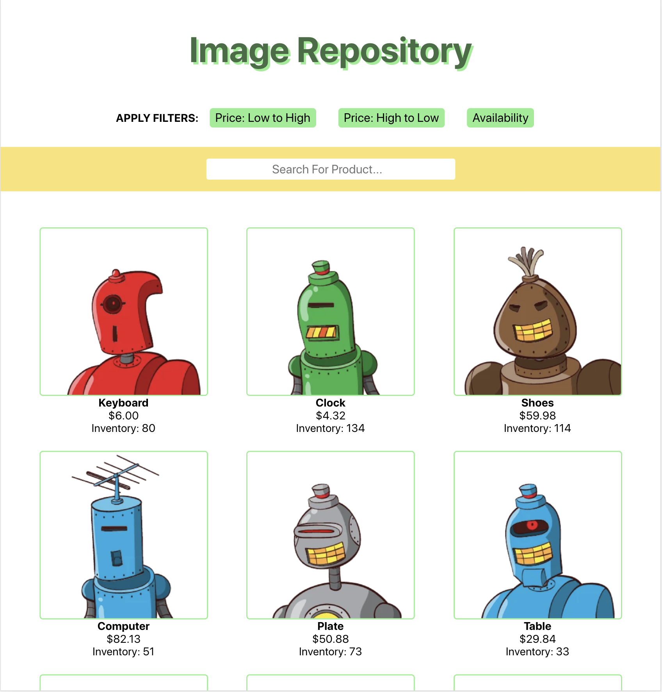

<h1>Image Repository</h1>

*** still a work in progess ***

Shopify 2020 Summer backend developer challenge (image repository).

<h2>Brief Summary (so far)</h2>
<li>Utilizes the shopify mobile challenge API to get the products</li>
<li>Main feature: Product Search/Filter functionality (todo)</li>
<li>Tech Stack: Typescript, NestJS, React, MongoDB</li>
<h2>User Interface</h2>

</img>
