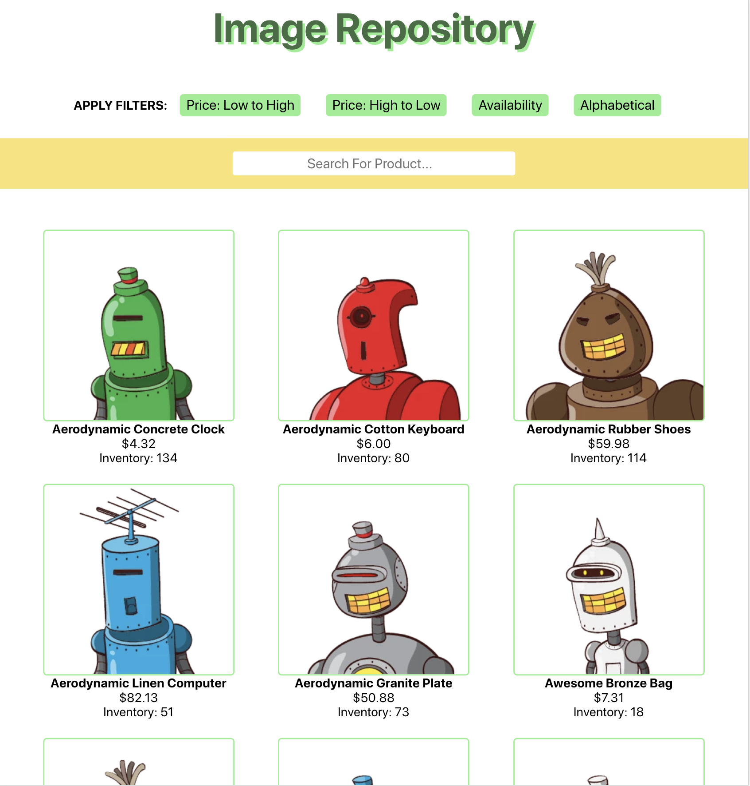

<h1>Image Repository</h1>

*** work in progess ***

Shopify 2020 Summer backend developer challenge (image repository).

<h2>Brief Summary (so far)</h2>
<li>Main feature: Product keyword search functionality. (todo)</li>
<li>Other features: Utilizes the shopify mobile challenge API to get the products and different filter options for viewing the products.
</li>
<li>Tech Stack: Typescript, NestJS, React, MongoDB</li>
<h2>User Interface</h2>

</img>
